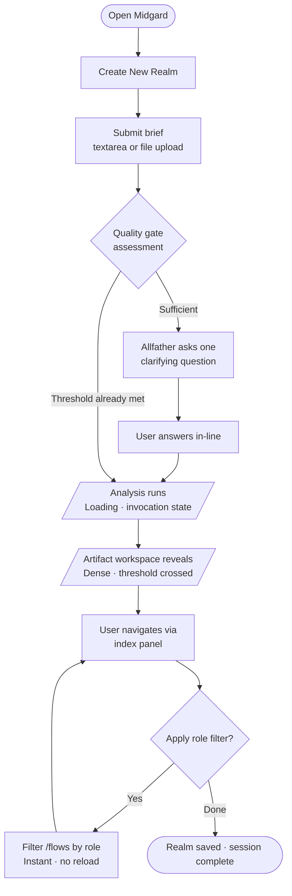
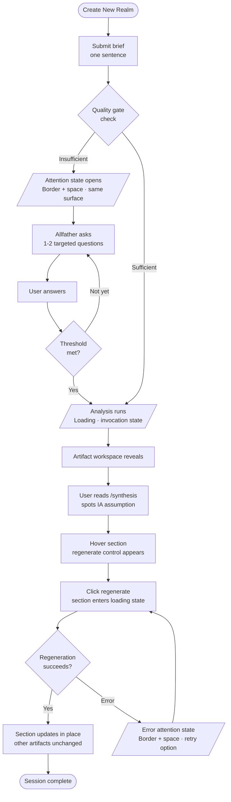
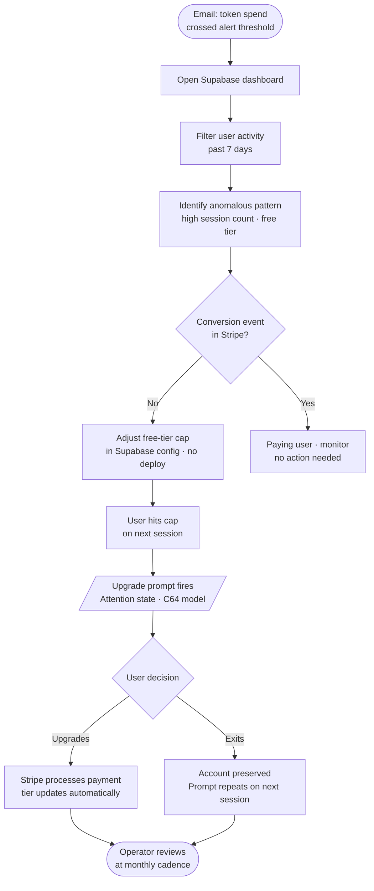
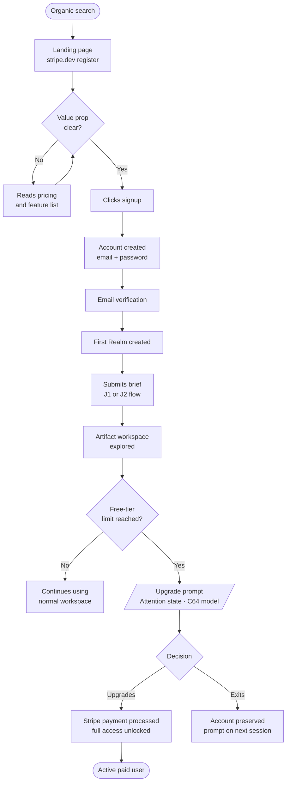

# UX Design Specification — Midgard

**Author:** Jason
**Date:** 2026-04-16

---

## Executive Summary

### Project Vision

Midgard compresses 1-2 days of manual brief synthesis into under 10 minutes by producing structured, navigable, UX-native artifacts from conversational input. The differentiating moment: when a paragraph of brief input renders as a role-filtered user flow, the user stops perceiving a chatbot and starts perceiving a tool. Every UX decision must protect and amplify that moment.

### Target Users

**Primary — Solo Designer/Contractor (Maya archetype):** Professional UX designer or contractor who receives vague client briefs and needs to move from ambiguity to a working mental model before opening Figma. Design-tool fluent, time-pressured, desktop worker. Uses Midgard at low frequency but high dependency — returns with every new client brief. Output is a personal working document, not a client deliverable.

**Secondary — Operator (Jason archetype):** Solopreneur who builds and maintains Midgard. Monitors token spend and free-tier usage remotely via infrastructure and billing dashboards. No custom admin UI in MVP.

### Key Design Challenges

1. **Mode transition:** The product shifts from conversational input to structured artifact workspace. The handoff — brief submitted → loading → artifacts arrive — is the single most critical UX moment. It must feel intentional and transformative, not like a page swap.
2. **Loading state duration:** Generation runs for potentially several minutes. The Norse-flavored loading state carries trust and retention responsibility — it must manage expectation actively, not passively.
3. **Artifact workspace navigation:** Instantaneous transitions between 4 artifact types with active role filtering creates a stateful, multi-artifact workspace with no obvious prior art. Context must be preserved and legible at all times.
4. **Input quality gate UX:** When the brief is too thin, follow-up questions must feel helpful and conversational — not a form, not a wall.
5. **Conversion moment:** The upgrade prompt when the free-tier limit is hit must feel earned and well-timed, not punitive.

### Design Opportunities

1. **The arrival moment:** First artifact render is the product's emotional peak. Intentional choreography of how artifacts appear — what the user sees first, whether there's a reveal sequence — can make this moment land hard.
2. **Artifact workspace as a professional tool:** Role filtering, cross-artifact navigation, and section regeneration together form a miniature design workspace. Designing this as a tool — not a viewer — is the path to the "wow moment."
3. **Brand voice as UX layer:** Norse microcopy in loading states extends naturally into empty states, error messages, and upgrade prompts. A consistent, crafted voice makes a solopreneur product feel designed.

## Core User Experience

### Defining Experience

The core user action is a two-phase flow: **input phase** (brief submission through guided agent or file upload, with quality gate if needed) and **artifact phase** (navigable workspace with 4 structured artifact types). These two phases feel distinct; the transition between them is the product's defining moment.

The action that must be effortless: navigation within the artifact workspace — instantaneous tab switching, role filter toggling, and section regeneration that updates locally without disrupting adjacent artifacts.

The action that must be flawless on first use: brief submission → loading → artifact reveal. This sequence cannot be recovered from if it fails to impress.

### Platform Strategy

- **Platform:** Web SPA (client-side, authenticated app); SSR/SSG marketing landing page
- **Input modality:** Mouse and keyboard primary; desktop and tablet viewports
- **Mobile:** Explicitly out of scope for V1 — complex multi-artifact workspace is a distinct UX problem, not a responsive CSS fix
- **Browser support:** Last 2 versions of Chrome, Firefox, Safari, Edge
- **Accessibility:** WCAG 2.1 AA across all authenticated surfaces and marketing page

### Effortless Interactions

- **Artifact tab navigation:** Must feel like a keyboard shortcut — click, instant response, no transition animation longer than necessary. User should never wait.
- **Role filter toggle:** Switching role in the user flow view must feel like flipping a switch, not requesting new data. State is visual, not computational.
- **Section regeneration:** Triggering a single-section re-run must feel local — that section updates; nothing else moves. User's context and surrounding artifacts stay intact.
- **File upload:** Drag-and-drop or click, immediate visual confirmation, no form-fill ceremony.
- **Brief submission:** Single action — paste or type, press submit. The guided agent asks; the user answers. No explicit "send to AI" ceremony required.

### Critical Success Moments

1. **First artifact render (The Wow Moment):** When the user flow appears from a paragraph of input and is navigable and role-filtered, this is the moment the product earns its price. Every design decision in the generation-to-workspace transition must protect this beat.
2. **Role filter comprehension:** When a user switches role and the flow reshapes instantly, they understand the depth of what was generated. This is when "chatbot output" becomes "UX tool."
3. **Section regeneration trust:** When the IA regenerates and the personas stay intact, the user understands the product respects their work. Trust is earned here.
4. **Input quality gate recovery:** When the follow-up questions are targeted and the user answers in 2 sentences and generation proceeds, the gate feels like help, not friction.
5. **Free-tier limit hit:** The upgrade prompt must arrive at a moment of demonstrated value — ideally after a successful generation — not as a cold wall.

### Experience Principles

1. **The interface disappears into the output.** Every UI decision should direct attention to the artifacts. Chrome, navigation, and controls serve the content — they don't compete with it.
2. **Earn the wait.** The loading state is a design problem, not a spinner. It must actively manage expectation, build anticipation, and maintain trust across a multi-minute wait.
3. **Never lose the user's context.** With 4 artifact types and role filtering active, the user must always know: what am I looking at, what role is active, and where can I go next. Context anchors must be persistent and legible.
4. **Phases are clear.** Input phase and artifact phase feel distinct. The user always knows which mode they're in. No ambiguity about whether input is still being processed or artifacts are ready.
5. **Ask, don't guess.** The quality gate principle — targeted questions over guessed output — extends to every uncertain moment in the interface. Error states ask for recovery; empty states prompt next action; upgrade moments offer context.

## Desired Emotional Response

### Primary Emotional Goals

**Primary:** Confidence — the feeling of walking into a room prepared when you weren't an hour ago. Midgard's job is to transform a panicked designer into a composed one. The product succeeds when users feel capable and oriented, not when they feel impressed by AI.

**Secondary:** Competence amplification — the tool makes the designer sharper, not redundant. The output validates their instincts and fills gaps; it doesn't replace their judgment. Users should feel like they did the thinking faster, not that a machine did it for them.

**Differentiating emotion:** Surprise that converts to trust. The wow moment — when the flow renders and it's actually useful — produces genuine surprise. That surprise is a one-time event; trust is what it must convert into. Every subsequent interaction builds or erodes that trust.

### Emotional Journey Mapping

| Stage | Target Emotion | Risk Emotion | Design Response |
|---|---|---|---|
| Landing page | Skeptical curiosity → cautious interest | Dismissal ("just ChatGPT") | Landing page must answer "is this actually different?" visually, not in prose |
| First brief input | Engaged focus | Anxiety about quality | Guided agent feels like a competent colleague interviewing you, not a form |
| Quality gate triggered | "Oh, it understands what's missing" | Criticism / rejection | Questions must be targeted and specific — signal intelligence, not complaint |
| Loading state | Managed anticipation | Dread (long wait, no feedback) | Norse microcopy describes what's being built; no quantitative progress bars |
| First artifact render | Surprise → delight → relief | Disappointment | Intentional reveal choreography; artifacts must look structurally trustworthy immediately |
| Artifact workspace | Productive flow state | Overwhelm | Tool disappears; artifacts are foregrounded; navigation is invisible when correct |
| Section regeneration | Ownership and trust | Uncertainty ("what will change?") | Local update only; clear affordances; surrounding artifacts visibly unchanged |
| Error state | Safe and recoverable | Helpless / stuck | Name what happened; offer one specific next action; never a dead end |
| Free-tier limit hit | Recognition of value | Punishment / friction | Arrives after demonstrated value; surfaces what was received before asking for payment |
| Returning user | Familiarity and efficiency | Re-learning fatigue | No re-orientation required; last project state visible immediately |

### Micro-Emotions

**Must achieve:**
- **Confidence** at artifact render — output looks structurally trustworthy before content is evaluated
- **Anticipation** during loading — not anxiety; something is being built, not stalled
- **Ownership** at section regeneration — this is my artifact, the tool helped me shape it
- **Relief** at quality gate recovery — targeted questions feel like being understood, not interrogated

**Must avoid:**
- **Overwhelm** in the artifact workspace — 4 artifact types with role filtering could feel like too much; navigation must be invisible when correct
- **Confusion** at mode transition — users must always know whether they're in input phase or workspace phase
- **Inadequacy** at quality gate — follow-up questions must never feel like criticism of the user's brief
- **Dread** during loading — multi-minute waits without qualitative feedback produce anxiety, not anticipation

### Design Implications

- **Confidence → Structural trust signals:** Artifacts must look well-formed before the user reads them — clear visual hierarchy, labeled role tags, section headers that signal professional output. First impression is structural, not textual.
- **Wow moment → Intentional reveal choreography:** First artifact render should feel like a reveal, not a page load. Consider staggered section appearance or a brief "ready" state before the workspace transition.
- **Managed anticipation → Qualitative loading copy:** Norse microcopy describes what is being synthesized, not how far along the process is. No progress bars that can feel stuck. Each microcopy line should stand alone as interesting.
- **Ownership → Clear regeneration affordances:** Section-level regeneration controls should be visible on hover with explicit labeling ("Regenerate this section"). The surrounding artifacts must visibly remain unchanged — stability of context is the trust signal.
- **Safety → Named error states:** Every error message names the specific failure, offers one clear next action, and maintains the user's project state. "Generation failed — your brief was saved. Try again?" not "An error occurred."
- **Earned upgrade → Value-first conversion:** The free-tier limit prompt surfaces after a successful generation, leading with what the user just accomplished before presenting the upgrade offer.

### Emotional Design Principles

1. **Confidence over cleverness.** The goal is a prepared designer, not an impressed user. Every visual decision should reinforce competence and orientation, not showcase AI capability.
2. **The wait is part of the product.** Loading is not dead time — it's managed anticipation. The Norse microcopy is a UX feature, not a cosmetic detail.
3. **Structural trust before content trust.** Users evaluate whether output looks right before they evaluate whether it reads right. Visual hierarchy and artifact formatting carry the first impression.
4. **Errors are recoverable moments, not failures.** Every error state must restore the user's sense of control within one action. No dead ends. No ambiguity about next steps.
5. **Surprise once; trust always.** The wow moment happens on first use. The product's long-term job is to deepen trust — through artifact reliability, regeneration stability, and consistent brand voice — so the user returns without needing to be surprised again.

## UX Pattern Analysis & Inspiration

### Inspiring Products Analysis

**Figma — Infinite canvas, zero disorientation**
The spatial model works because orientation anchors (layers panel, property panel, zoom level) are always legible, and the canvas itself has no visual edge. Power features (components, variants, auto-layout) are invisible until invoked. The product respects that its user is a professional — no forced onboarding, no progressive disclosure of basics. Discoverability comes from consistency of metaphor, not hand-holding.

*Midgard relevance:* Artifact workspace navigation should be discoverable through consistent affordances, not tooltips. Power interactions (section regeneration, role filter) appear contextually — visible when relevant, absent when not.

**Linear — Opinionated speed**
Keyboard-first, brutally fast, UI with a point of view. Every interaction is intentional; nothing is left undefined "for flexibility." The feeling of being "let in on something" comes from specificity — it feels built by people with strong opinions about how tools should work, not designed by committee. The perceived exclusivity is entirely earned through craft, not price or gatekeeping.

*Midgard relevance:* The artifact workspace should have opinions. Navigation should have keyboard shortcuts. The product should feel like it was built by someone who was annoyed by every other tool in this space — because it was.

**Raycast — Interface as pure utility**
The chrome is zero. You invoke it, accomplish the goal, it's gone. No dashboard, no ambient presence, no upsell surface. The first interaction communicates craft immediately and completely. The product signals taste without explaining itself.

*Midgard relevance:* The artifact workspace should reduce chrome to near-zero. Navigation controls, regeneration affordances, and role filters should be contextual — present when needed, invisible when not. The product should feel like it was made by someone who cares about the craft of making tools.

**stripe.dev — Primary visual and tonal direction for Midgard**
Monospace type. Stark contrast. Slash-prefixed labels (`/reference`, `/changelog`). Figure numbers. The aesthetic communicates credibility without explaining itself — it is designed for someone who already knows what they're looking at. Anti-marketing energy: it doesn't sell you on itself; it simply is.

*Midgard relevance:* This is the primary visual reference. Monospace type for labels, artifact identifiers, and system elements. Dark background, high contrast. Slash-prefixed navigation labels: `/flows`, `/personas`, `/ia`, `/synthesis`. Figure-number formatting for artifact sections. The visual language says: this is a professional tool, not a consumer app.

**Vercel dashboard — Authenticated app reference**
Minimal, dark, data-forward. Functional with taste — built by engineers who cared. Good reference for the authenticated experience: no landing page energy inside the app, no marketing chrome contaminating the workspace. You're immediately in the tool.

*Midgard relevance:* The authenticated app experience should feel like the Vercel dashboard — focused, dark, data-forward. The moment you're authenticated, you're in the tool.

**Resend marketing site — Landing page reference**
Same minimal dark family as stripe.dev applied to a slightly broader audience. Good reference for the Midgard marketing landing page: confident prose, dark background, deliberate typography, no decorative excess.

*Midgard relevance:* Landing page visual language. Same aesthetic family as the authenticated app — the brand is consistent from landing to workspace.

**NotebookLM artifact workspace — Spatial layout reference**
The three-panel resizable layout gives users a persistent spatial sense of the full content landscape. Tabs hide context — you can only see one panel at a time and must mentally model what's elsewhere. A persistent panel layout lets the user see the full artifact set simultaneously, reducing working memory load and enabling cross-artifact reading.

*Midgard relevance:* **Resolved — persistent two-panel layout adopted.** Primary content area (70–75% width) + persistent artifact index panel (25–30% width). On tablet, index panel collapses to icon strip. See Spatial Layout Decision below.

**Norse brand system — Voice, naming, and visual language**
The product is named Midgard. Projects are **Realms**. The analysis engine is the **Allfather** — all-knowing, synthesizes everything, sees the full picture. The internal design principle for brand voice is **"Runes and Iron"**: spare, confident, nothing decorative.

Loading microcopy should feel like **invocations**, not status updates:
- *"The Allfather sees."*
- *"Your Realm takes shape."*
- *"The flows are written."*

**Futhark script** is a potential subtle visual texture element — not readable content. It may appear in loading states, background treatments, or as a watermark. This is a visual language note, not a confirmed UI pattern. It should be evaluated at the visual design stage; if used, it must remain textural and non-decorative.

The Norse register is runes and iron, not Vikings the TV show. Spare and confident throughout every copy surface.

### Transferable UX Patterns

**Navigation Patterns:**
- **Slash-prefixed artifact labels** (stripe.dev) — `/flows`, `/personas`, `/ia`, `/synthesis` as navigation identifiers; typographic personality without decoration
- **Persistent two-panel layout** (NotebookLM, resolved) — primary content panel (70–75%) + artifact index panel (25–30%); spatially preserves orientation across all 4 artifact types; tablet collapses index to icon strip
- **Keyboard-first shortcuts** (Linear) — artifact switching, role filter toggle, section regeneration should all have keyboard bindings

**Interaction Patterns:**
- **Contextual power feature reveal** (Figma) — section regeneration controls visible on hover only; role filter prominent in flow view, absent elsewhere; no buttons competing when irrelevant
- **Chrome reduction** (Raycast) — artifact workspace should have near-zero ambient UI; controls appear contextually, not persistently
- **Opinionated defaults** (Linear) — default to the most useful view (user flow, primary role); don't ask the user to configure before they've seen anything

**Visual Patterns:**
- **Monospace type for system elements** (stripe.dev) — labels, artifact identifiers, figure numbers, system messages in monospace; body content in proportional type
- **Dark high-contrast aesthetic** (stripe.dev + Vercel) — default dark mode for authenticated app; high contrast, minimal decorative chrome
- **Figure-number artifact formatting** (stripe.dev) — artifacts presented as structured reference documents, not content cards or chat bubbles
- **Invocation-style loading microcopy** (Norse brand system) — loading state uses Allfather/Realm vocabulary; each line reads as a standalone invocation, not a progress status

### Anti-Patterns to Avoid

- **Tabbed navigation that hides artifact context** — resolved in favour of persistent panels; standard tab pattern explicitly rejected
- **Onboarding wizards or forced walkthroughs** — professional user; no hand-holding
- **Quantitative progress bars** — Norse microcopy is the loading experience; no percentages or progress indicators that can feel stuck
- **Dashboard-first authenticated landing** — arriving logged-in should surface the Realms list or last-accessed Realm immediately; no analytics dashboard between login and work
- **Decorative Norse aesthetic** — no cartoonish runes, no illustrated dragons, no ornamental borders; Futhark script is texture only and not confirmed; the Norse system is naming and voice
- **Consumer app visual language** — rounded buttons, pastel gradients, illustration-heavy empty states; the target user is a professional designer; the visual register must match

### Design Inspiration Strategy

**Adopt:**
- Slash-prefixed navigation labels (stripe.dev)
- Dark high-contrast aesthetic: stripe.dev + Vercel (authenticated), Resend (landing page)
- Monospace type for system elements, labels, and artifact structure
- Norse brand voice: "Runes and Iron" — spare, confident, invocation-style throughout all copy surfaces
- Keyboard-first interaction model (Linear)
- Persistent two-panel spatial layout (resolved)

**Adapt:**
- Figma's contextual power feature reveal → section regeneration controls on hover; must include accessible keyboard and screen reader equivalents
- Two-panel layout proportions → tablet degradation: index panel collapses to icon strip; primary content panel expands to full width

**Avoid:**
- Standard tabbed artifact navigation
- Consumer app visual register
- Quantitative AI progress indicators
- Decorative or costumed Norse interpretation

### Spatial Layout Decision (Resolved)

**Adopted: Option B — Persistent Two-Panel Layout**

| Element | Specification |
|---|---|
| Primary content panel | 70–75% viewport width; active artifact rendered at full fidelity |
| Artifact index panel | 25–30% viewport width; all 4 artifact types persistently visible with summary content |
| Tablet breakpoint | Index panel collapses to icon strip; primary panel expands to full width |
| Mobile | Out of scope for V1 |
| Panel resize | Not required for V1; fixed proportions acceptable at launch |

The index panel serves as a persistent spatial anchor — the user always knows what artifacts exist and can navigate without losing their current position. This directly supports the "never lose context" experience principle.

### Norse Brand System (Reference)

| Element | Name / Convention |
|---|---|
| Product | Midgard |
| Projects | Realms |
| Analysis engine | The Allfather |
| Brand voice principle | Runes and Iron |
| Loading microcopy register | Invocations, not status updates |
| Futhark script | Visual texture only — not confirmed; evaluate at visual design stage |

**Sample loading invocations:**
- *"The Allfather sees."*
- *"Your Realm takes shape."*
- *"The flows are written."*

## Design System Foundation

### Design System Choice

**Tailwind CSS + shadcn/ui**

Built on Radix UI accessibility primitives. Components are copy-paste, not installed dependencies — full ownership, no library lock-in. Dark mode first-class. Natural Next.js pairing.

### Rationale for Selection

- **Solopreneur speed:** shadcn/ui provides ready-to-use accessible components without building from scratch; the developer owns the code and can modify freely
- **Aesthetic compatibility:** The stripe.dev visual register (dark, high-contrast, monospace, minimal chrome) is achievable with Tailwind tokens without fighting default styles
- **Accessibility compliance:** Radix UI primitives provide WCAG 2.1 AA-compliant keyboard navigation, focus management, and screen reader support out of the box — directly satisfying the PRD accessibility NFRs
- **Dark mode:** First-class support via Tailwind's `dark:` variant; no theme override architecture required
- **Stack alignment:** Native Next.js pairing; used by Vercel, Linear, and the primary reference tools in the inspiration set

### Implementation Approach

**Design tokens to establish:**
- Color scale: dark background system (near-black base, subtle surface layers, high-contrast foreground)
- Typography: **Geist Mono** for labels, identifiers, and system elements; proportional stack for artifact body content
- Spacing scale: Tailwind defaults with custom additions for panel proportions
- Focus ring: high-visibility focus indicator for keyboard navigation compliance

**shadcn/ui components to adopt directly:**
- Dialog, Sheet, Tooltip, Dropdown Menu — interaction primitives
- Button, Input, Textarea — form elements
- Badge — role tags on personas and flow nodes
- Separator, ScrollArea — layout utilities

**Custom components to build:**
- `ArtifactWorkspace` — persistent two-panel layout container; handles 70/30 split and tablet collapse to icon strip
- `ArtifactIndexPanel` — 25–30% panel showing all 4 artifact types with summary content; slash-prefixed labels (`/flows`, `/personas`, `/ia`, `/synthesis`)
- `ArtifactContent` — primary panel; renders active artifact with figure-number section structure
- `RoleFilterToggle` — role selector for user flow view; visual switch, not a dropdown
- `SectionRegenerateControl` — hover-reveal affordance on individual artifact sections
- `AllFatherLoadingState` — full-screen or panel loading state with invocation microcopy; Futhark texture placeholder if adopted

### Customization Strategy

The stripe.dev aesthetic is implemented through Tailwind design tokens, not component overrides. Key customizations:

- Override Tailwind's default color palette with a custom dark-mode-first scale: near-black background (`#0a0a0a` range), subtle surface (`#111` / `#1a1a1a`), muted foreground, high-contrast primary text
- **Geist Mono** as the `font-mono` Tailwind stack target for all system elements, labels, and identifiers — consistent with the Vercel aesthetic family
- Slash-prefix as a CSS convention for navigation labels: `before:content-['/']` or explicit markup
- Figure-number artifact section formatting via a custom Tailwind component class
- Norse invocation microcopy delivered via a curated string array; no external copy system required at V1

## Core Interaction Design

### 2.1 Defining Experience

**"Describe your product to the Allfather. Your Realm is ready."**

The defining experience is the brief-to-artifact pipeline: a designer pastes a vague product description into a conversational input, the Allfather synthesizes it, and a complete, navigable UX foundation appears. The user does not configure anything, write prompts, or interpret text output. They describe a product; they receive a structured tool.

If we nail one interaction: **the reveal** — the moment the loading state dissolves and the artifact workspace appears for the first time, with a navigable user flow already rendered and role-filtered. This is the moment the product earns everything that follows.

### 2.2 User Mental Model

**What users bring:**
- ChatGPT/Claude mental model: text in → text out → interpret and reformat manually
- Expectation of a chat interface with a response to read, not a workspace to navigate
- Skepticism that AI output will be structurally usable without editing

**The mental model shift Midgard must accomplish:**
- From: "I'm prompting an AI" → To: "I'm using a UX tool"
- From: "I'll need to interpret and reformat this" → To: "This is already in the shape I need"
- This shift happens at the reveal moment — and only if the artifacts look structurally trustworthy immediately

**Where users will be confused without good design:**
- The transition from input phase to artifact phase — "am I still in the chat?" needs a clear spatial and visual break
- What the Allfather is doing during loading — silence reads as broken; invocations read as working
- Whether role filtering changes the underlying data or just the view — must feel like a visual filter, not a re-query

### 2.3 Success Criteria

The core experience is successful when:

1. User can paste a brief and submit without reading any instructions
2. The input quality gate (if triggered) feels like a helpful colleague asking one good question, not a form rejection
3. The loading state sustains trust for the full generation duration without anxiety
4. The first artifact panel contains a navigable, role-filtered user flow that the user can immediately engage with — no configuration required
5. The user can switch to `/personas` in the index panel without any perceptible delay
6. The user always knows which role filter is active and how to change it
7. Section regeneration triggers, executes, and resolves without disturbing any other artifact in the workspace

### 2.4 Novel UX Patterns

**Established patterns used:**
- Conversational text input (chat-native; no learning required)
- Tab-equivalent navigation (via index panel; spatial but familiar)
- Hover-reveal controls (standard; used in Figma, Notion, Linear)

**Novel patterns that require deliberate design:**

- **Full-workspace reveal (not streaming):** Most AI tools stream text progressively. Midgard reveals a complete, structured workspace all at once after a loading state. This is a higher-stakes UX moment — it can land as impressive or disappointing, with little middle ground. The reveal must be choreographed.
- **Persistent artifact index as spatial anchor:** The index panel showing all 4 artifact types simultaneously is not a standard web pattern. Users must learn to read it as a navigation surface, not a sidebar widget. Design must make this obvious without explanation.
- **Role filter as a view lens, not a query:** The role filter toggle changes what the user sees in the flow view without re-running anything. This is visually analogous to filtering a table, but spatially more like switching a lens. The interaction must feel instantaneous and reversible to communicate this correctly.
- **Input quality gate as a conversation turn:** The gate is not a validation error. It is the Allfather asking a targeted question before proceeding. This is a novel framing — "the tool interviewed me" rather than "the form rejected me."

**Education strategy for novel patterns:**
- Persistent index panel: labeled clearly on first render with artifact type names and slash-prefix; affordance is self-evident
- Role filter: pre-selected on first render; label reads "Viewing as: [Role]" — explains itself without a tooltip
- Section regeneration: hover reveals a clearly labeled control; no discovery required; works or is ignored
- No onboarding flow required — the patterns are designed to be self-evident at first contact

### 2.5 Experience Mechanics

**Phase 1 — Brief Input**

| Stage | User Action | System Response |
|---|---|---|
| Initiation | Arrives at new Realm | Brief input area is dominant; placeholder: *"Describe your product to the Allfather."*; file upload secondary |
| Input | Pastes or types product description | No response until submission; guided agent waits |
| Quality gate (if triggered) | Submits thin brief | Allfather responds inline with up to 2 targeted questions: *"Two things before the Allfather can see clearly: [question 1]. [question 2]."* |
| Quality gate response | User answers in the same input field | Brief is enriched; submission proceeds |
| Submission | User submits enriched brief | `AllFatherLoadingState` takes over |

**Phase 2 — The Allfather Works (Loading)**

| Stage | User Experience | Design Response |
|---|---|---|
| Loading initiation | Brief submitted | Full-screen or panel loading state; Norse invocation begins |
| Loading sustain | Waiting (multi-minute) | Invocations cycle: *"The Allfather sees." / "Your Realm takes shape." / "The flows are written."* Futhark texture (if adopted) as background element |
| No quantitative indicator | — | No progress bar, no percentage, no spinner with counter |
| Loading completion | Generation finishes | Reveal transition begins |

**Phase 3 — The Reveal (Wow Moment)**

| Stage | What Happens | Design Requirement |
|---|---|---|
| Transition | Loading state dissolves | Intentional choreography — brief fade or cross-fade into workspace; not an instant swap |
| First view | Artifact workspace appears | `/flows` active in primary panel by default; user flow rendered at full fidelity; primary role pre-selected in role filter |
| Index panel | All 4 artifact types visible | `/flows` highlighted as active; `/personas`, `/ia`, `/synthesis` show summary content; slash-prefixed labels |
| Immediate legibility | User flow is navigable | Nodes, paths, and role labels visible without scrolling on desktop viewport |

**Phase 4 — Artifact Workspace**

| Interaction | User Action | System Response | Timing |
|---|---|---|---|
| Artifact navigation | Clicks `/personas` in index panel | Primary panel transitions to personas view | < 100ms, no loading state |
| Role filter | Clicks role toggle | Flow view updates to selected role | < 100ms, visual filter only |
| Section regeneration | Hovers artifact section | Regenerate control appears | Hover: immediate |
| | Clicks regenerate | That section enters loading state; other artifacts unchanged | Section-local only |
| | Regeneration complete | Section updates in place | Workspace stable |
| Project list | Returns to Realm list | Last-visited Realm state preserved | No re-orientation required |

## Visual Design Foundation

### Color System

**Design Philosophy:** Dark-first, high-contrast, monochromatic with a single purposeful accent. Color communicates state and hierarchy — never decoration. This is the "Iron" half of Runes and Iron.

**Base Palette (Zinc/Slate Scale)**

| Token                | Value     | Usage                                           |
|----------------------|-----------|-------------------------------------------------|
| `background`         | `#0A0A0A` | Page and app background                         |
| `surface`            | `#111111` | Card, panel, modal backgrounds                  |
| `surface-elevated`   | `#1C1C1E` | Hover states, dropdowns, secondary panels       |
| `border`             | `#27272A` | Dividers, panel borders, input outlines         |
| `muted`              | `#3F3F46` | Disabled states, inactive elements              |
| `foreground`         | `#FAFAFA` | Primary text, headings, active labels           |
| `foreground-muted`   | `#A1A1AA` | Secondary text, descriptions, metadata         |
| `foreground-subtle`  | `#52525B` | Placeholder text, tertiary information          |

**Accent Palette**

A single warm accent — used exclusively for primary interactive elements and active states. Nods to rune-glow without decorative excess.

| Token                | Value     | Usage                                           |
|----------------------|-----------|-------------------------------------------------|
| `accent`             | `#E8D5A3` | Primary CTAs, active nav item, focus rings      |
| `accent-muted`       | `#A89060` | Hover state on accent elements                  |
| `accent-surface`     | `#1E1A11` | Subtle background tint for accent contexts      |

**Semantic Palette**

| Token                | Value     | Usage                                           |
|----------------------|-----------|-------------------------------------------------|
| `success`            | `#22C55E` | Analysis complete, quality gate passed          |
| `warning`            | `#F59E0B` | Quality gate partial, approaching token limit   |
| `destructive`        | `#EF4444` | Errors, destructive actions                     |
| `info`               | `#3B82F6` | Informational states, loading indicators        |

**Contrast Compliance**

All primary text (`foreground` on `background`) achieves WCAG AA at minimum. Accent color on surface backgrounds exceeds 4.5:1 contrast ratio for interactive elements. `foreground-muted` meets AA for large text (18px+) and is reserved to secondary information only.

---

### Typography System

**Design Philosophy:** Monospace for system — proportional for content. The interface speaks in code syntax; artifacts speak in prose. Each typeface has a clear job.

**Type Pairings**

| Role              | Typeface      | Weight         | Usage                                              |
|-------------------|---------------|----------------|----------------------------------------------------|
| System / UI       | Geist Mono    | 400, 500, 600  | Labels, navigation, slash-prefixed identifiers, artifact type tags, figure numbers, metadata |
| Body / Content    | Geist Sans    | 400, 500       | Artifact prose content, descriptions, onboarding  |
| Heading           | Geist Sans    | 600, 700       | Page titles, section headings, artifact titles    |

_Rationale: Geist Sans and Geist Mono share optical metrics (same Vercel family), eliminating visual tension when they appear together. Geist Sans has the same spare, functional quality as Geist Mono — no personality collision._

**Type Scale**

| Level       | Size      | Weight | Line Height | Usage                                    |
|-------------|-----------|--------|-------------|------------------------------------------|
| `display`   | 2.25rem   | 700    | 1.2         | Landing page hero only                   |
| `h1`        | 1.875rem  | 700    | 1.25        | Page-level headings (Realm title)        |
| `h2`        | 1.5rem    | 600    | 1.3         | Section headings within artifacts        |
| `h3`        | 1.25rem   | 600    | 1.35        | Sub-section headings                     |
| `h4`        | 1.125rem  | 600    | 1.4         | Component-level labels                   |
| `body`      | 1rem      | 400    | 1.6         | Primary prose in artifact content        |
| `small`     | 0.875rem  | 400    | 1.5         | Metadata, secondary labels               |
| `mono`      | 0.875rem  | 500    | 1.4         | Slash labels, figure numbers, identifiers|
| `caption`   | 0.75rem   | 400    | 1.4         | Timestamps, helper text                  |

**Slash-Prefix Convention (from stripe.dev)**

Navigation and artifact labels use lowercase monospace with slash prefix: `/flows` `/personas` `/ia` `/synthesis`

These function as the primary spatial identity markers in the artifact workspace.

---

### Spacing & Layout Foundation

**Design Philosophy:** Efficient and dense, not cramped. Data-forward. The Realm workspace rewards focused attention — breathing room is used to create hierarchy, not fill space.

**Base Grid: 8px**

All spacing values are multiples of 8px (or 4px for fine-grained sub-unit adjustments). Tailwind's default 4px scale is used with deliberate selection at the 8px-aligned steps.

| Token     | Value  | Tailwind Class | Usage                                             |
|-----------|--------|----------------|---------------------------------------------------|
| `space-1` | 4px    | `p-1`          | Icon internal padding, tight badges               |
| `space-2` | 8px    | `p-2`          | Compact element padding, index panel items        |
| `space-3` | 12px   | `p-3`          | Standard element padding                          |
| `space-4` | 16px   | `p-4`          | Component standard padding                        |
| `space-6` | 24px   | `p-6`          | Section padding, card padding                     |
| `space-8` | 32px   | `p-8`          | Page section spacing                              |
| `space-12`| 48px   | `p-12`         | Large section gaps                                |
| `space-16`| 64px   | `p-16`         | Page-level vertical rhythm                        |

**Two-Panel Layout Dimensions**

Locked in Step 5. Formalized here as layout tokens:

| Token                  | Value         | Description                                      |
|------------------------|---------------|--------------------------------------------------|
| `panel-index-width`    | 260px (25%)   | Artifact index panel — desktop default           |
| `panel-content-width`  | 75%           | Primary content area — desktop default           |
| `panel-index-collapsed`| 56px          | Icon-strip width — tablet                        |
| `panel-breakpoint`     | 1024px (lg)   | Index collapses to icon strip                    |
| `panel-breakpoint-sm`  | 768px (md)    | Full single-column (mobile)                      |

**Layout Principles**

1. **Content density over padding:** Artifact workspaces favor efficient information display — sufficient breathing room without generous whitespace. This is a tool, not a marketing site.

2. **Hierarchy through spacing, not dividers:** Section separation uses whitespace rather than visual rules where possible. When borders are used, they use `border` token to avoid visual noise.

3. **Sticky structural chrome:** The artifact index panel and top navigation are sticky. Content areas scroll independently. Users always know where they are.

4. **Input phase vs. workspace phase:** The brief input experience uses more generous vertical spacing and a centered, narrower layout (max-width: 640px centered) to create focus. The workspace phase switches to the full-width two-panel layout.

---

### Accessibility Considerations

**Color Contrast**
- All body text meets WCAG 2.1 AA (4.5:1 minimum)
- `foreground` on `background`: ratio exceeds 15:1
- `foreground-muted` used only for large text (18px+) where AA is met at 3:1
- `accent` on `surface` meets 4.5:1 for interactive element labeling
- Never convey state through color alone — pair with icon or label

**Typography Accessibility**
- Minimum body text size: 16px (1rem) — never smaller for prose content
- Geist Sans at 16px/1.6 line-height produces comfortable long-form readability
- Geist Mono at 14px/1.4 is acceptable for UI labels; never used for prose passages

**Motion and Loading States**
- The `AllFatherLoadingState` component (invocation microcopy) should respect `prefers-reduced-motion` — disable animations, show text-only state
- All loading animations should complete within a single animation cycle or loop gently; no jarring interruptions

**Focus Management**
- Custom focus ring uses `accent` color at 2px offset — visible on all surface colors
- Tab order follows reading order throughout the two-panel layout
- Panel switching (index → content) announces to screen readers via aria-live region

**Form Input (Brief Submission)**
- Error states combine `destructive` color + icon + descriptive text (never color-only)
- Quality gate feedback (FR3/FR5) uses inline contextual messaging, not toast-only

## Design Direction Decision

### Design Directions Explored

Five initial directions (D1–D5) were generated to explore variations in accent presence, panel depth, type density, and section structure. After review, the direction was reframed around a deeper set of references. The five initial directions remain as visual foundation explorations; the chosen direction names the underlying aesthetic system that governs them all.

### Chosen Direction: Derived Systems

A synthesis of four simultaneous references held together by one connective principle: everything is derived from function; the grid is law; no decoration earns its place without structural purpose.

**Reference 1 — Otl Aicher / Munich 1972 (Spatial Law)**

The underlying grid and construction logic users feel but never consciously identify. Strict modular geometry; 45-degree construction as a latent spatial law governing element placement, component proportions, and transition behavior. The system must be derivable on paper before it exists on screen. Precision users feel as calm; imprecision they register as noise.

**Reference 2 — Late-90s Editorial / Emigre-adjacent (Type Discipline)**

Tight leading. Small type treated as texture rather than reading matter. Information density as aesthetic statement, not usability compromise. Type is structural material — it creates rhythm, weight, and surface. The professional designer reads density as craft; looseness reads as inattention. This is the typographic register throughout the product.

**Reference 3 — MacCamp / Winamp Skin Aesthetic (Workspace Tone)**

The authenticated artifact workspace specifically. Dark chrome, tight monospaced labels, colored indicator elements functioning as status signals (not decoration), utility-first layout where every pixel earns its place. Industrial UI at its logical conclusion. Navigation items, section controls, and status elements look like they belong to a serious tool — not a SaaS product attempting approachability.

**Reference 4 — stripe.dev (Landing Page and Brand Register)**

Primary reference for the landing page, marketing surfaces, and public-facing brand register. Inside the authenticated app, stripe.dev's spare elegance gives way to MacCamp's denser, more industrial discipline. The transition is intentional.

### Design Rationale

The connective tissue across all four references: everything derived from function, grid as law, no decoration without structural justification.

This resolves a real tension in developer and design tool aesthetics. Many tools loosen density to signal approachability. Professional users read that looseness as imprecision. Midgard's primary user — the Maya archetype, professional designer/contractor — reads tight, dense, systematic UI as evidence of craft. The visual language must speak that language without apology.

Density is the aesthetic register, not a directive to shrink type or compress spacing. The original D1–D5 type sizes and spacing proportions are correct. The density principle applies to the overall register — a tool that takes its users seriously.

### Implementation Implications

**Grid (Aicher-derived)**

The 8px base grid becomes a strict modular grid. All component geometry, padding relationships, and layout proportions must be derivable from the base unit. No eyeballed spacing. No exceptions. The 45-degree construction principle surfaces in hover state transitions, loading animation geometry, and optional diagonal rule angles in section dividers.

**Typography (Emigre register)**

Type is structure. Dense passages of text in artifact content read as information texture — scannable, not necessarily read top-to-bottom. The type scale from step 8 is preserved and applied with intent; leading is tight throughout the workspace.

**Workspace tone (MacCamp/Winamp)**

The artifact workspace uses:
- Tight monospaced labels throughout the index panel and all content headers
- Accent, success, and warning tokens functioning as colored indicators — status signals, not brand warmth
- Section controls (regenerate, role filter) styled as utility controls — no visual softening
- Figure numbers (`1.0`, `2.0`) as the primary organizational device within artifact sections

**Split register (Landing vs. App)**

- Landing page / marketing surfaces: stripe.dev register — spare, high-contrast, branded
- Authenticated workspace: MacCamp register — dense, precise, functional, industrial
- The register shift on login is intentional and desirable

### Space as Functional Signal

Density is the resting state of the entire product. Space is the exception, and its scarcity is what makes it meaningful. When something requires the user's full attention — an error, a quality gate question, an upgrade prompt, a critical confirmation — it gets breathing room.

But it does not get a different visual language.

**The Commodore 64 model:** An attention state is more of the same surface, drawn with a border. Same background tokens. Same type. Same grid. A bordered region opens within the layout and receives space. The border isolates it. The space signals its weight. Nothing else changes. No backdrop blur. No elevated overlay. No theatrical interruption. The system does not change register — it draws a box and gives it room.

This is consistent with the lineage of early computing UI: the terminal dialog, the DOS installer, the C64 modal. All were the same surface with a border. That constraint produced clarity, not limitation.

**Moments that receive space and a border:**

| Moment                     | Why space is warranted                                    |
|----------------------------|-----------------------------------------------------------|
| Quality gate follow-up     | Brief insufficient; Allfather is asking a question        |
| Loading / invocation state | Generation running; user in active suspension             |
| Error state                | Failure requiring user decision; retry or recovery path   |
| Upgrade prompt             | Free-tier limit reached; a considered ask, not an alert   |
| Destructive confirmation   | Irreversible action; deserves deliberate interaction      |
| First artifact reveal      | The product's defining moment; space marks the threshold  |

**Moments that stay dense:**

| Moment                     | Why density is correct                                    |
|----------------------------|-----------------------------------------------------------|
| Artifact workspace         | Resting operating state; user is in flow, scanning        |
| Index panel navigation     | Utility interaction; no attention required                |
| Section regeneration       | Local action; should not disrupt surrounding context      |
| Role filter toggling       | Instant filter; no consequence, no ceremony               |
| Metadata and timestamps    | Supporting information; should recede                     |

**The arrival sequence as proof of concept:**

Brief input is dense. The loading/invocation state opens — a single centered bordered region, room to breathe, the Allfather's presence felt in the space. The workspace snaps to dense on reveal. Dense → spacious → dense encodes the threshold crossing without a word of instruction.

**Standing rules:**
1. Any element that receives space is implicitly communicating importance. If something gets breathing room and it isn't important, the system's credibility erodes.
2. Attention states use the same visual system — border and space are the complete vocabulary. No elevated surfaces, no backdrop treatments, no register change.
3. Space must be earned every time it is used.

**Standing constraint: Do not loosen.**

Any future pressure to increase padding, reduce density, or add white space must be evaluated against one question: does this change make the product feel more precise or less? Density is the position. Looseness is the failure mode.

## User Journey Flows

### Journey 1: Solo Designer — Happy Path

Maya has a decent brief and a 10am kickoff tomorrow. This is the product's primary success case — the flow that must be effortless and slightly impressive.

**Flow mechanics:**

- Entry is low friction: open Midgard, name the Realm, paste or upload the brief
- The quality gate passes silently — no interruption when the brief meets threshold
- The Allfather asks one clarifying question (if needed) in-line as a conversation turn
- The analysis runs: loading/invocation state — full attention, bordered region, sparse Allfather microcopy. This is the moment of suspension that makes the reveal land
- Artifact workspace reveals: workspace snaps to dense. The threshold has been crossed
- Navigation is instantaneous — clicking in the index panel never triggers a loading state
- Role filtering is instantaneous — a visual filter on the current view, not a re-fetch



---

### Journey 2: Solo Designer — Thin Brief

Same Maya, one sentence brief. The quality gate is the first real UX test — it must feel helpful, not punitive.

**Flow mechanics:**

- Brief submitted; quality gate fires immediately (within the input surface)
- Attention state opens: bordered region, breathing room, Allfather question (C64 model — same surface, no overlay, no page change)
- User answers in the attention state input; analysis proceeds when threshold is met
- Artifacts arrive — less sharp than a full brief, but structurally sound
- Maya reads /synthesis, spots an IA assumption
- Section regeneration: hover reveals control, click triggers section-local loading only — adjacent artifacts are untouched and remain readable during regeneration



---

### Journey 3: Operator — Token Cost Alert

Jason, alone, running the product. This flow never touches the user-facing UI. Everything happens in infrastructure dashboards. The design requirement is that the operator surface is sufficient for the task — no custom admin UI needed in V1.

**Flow mechanics:**

- Email alert arrives at a configurable threshold (not the ceiling — intervention window)
- Operator opens Supabase, filters by user activity — no bespoke tooling required
- Decision: adjust the free-tier cap directly in Supabase config, no deploy
- Next time the anomalous user submits a brief, they hit the cap
- Upgrade prompt fires as an attention state in the workspace (C64 model)
- The operator reviews the outcome at monthly cadence



---

### Journey 4: Prospective User — Discovery to Signup

The acquisition funnel. The design requirement: the landing page must close the loop without a sales interaction. Value proposition legible, pricing visible, signup frictionless, upgrade prompt well-timed.

**Flow mechanics:**

- Landing page is in stripe.dev register — spare, high-contrast, branded
- Pricing is visible without signup (removes a friction point)
- Signup is email-only in V1 (no OAuth complexity)
- First Realm creation mirrors J1 happy path
- Free-tier cap hit surfaces upgrade prompt as an attention state (C64 model — same workspace surface, bordered region, not a page takeover)



---

### Journey Patterns

Three patterns appear across all four journeys. Standardizing these now prevents inconsistency during implementation.

**Attention State Pattern (C64 model)**

Every moment requiring full user attention uses the same mechanism: bordered region, breathing room, same surface tokens. No overlay, no page change, no register shift. Appears in: quality gate (J2), error + retry (J2), upgrade prompt (J3, J4), destructive confirmation (implicit).

**Loading State Pattern**

Two loading modes only — never a spinner in a modal or a page-level loading state:
- *Full analysis load*: workspace phase has not yet begun; loading/invocation state is the full attention experience (spacious, Allfather microcopy, bordered region)
- *Section regeneration load*: section-local only; workspace remains stable and readable; adjacent artifacts are never disrupted

**State Preservation Pattern**

User state is never destroyed by an error or interruption. The brief is preserved if the quality gate fires. Completed artifact sections are preserved if a regeneration fails. The Realm is preserved if the user exits before finishing. This is a trust contract — violating it once breaks the product.

---

### Flow Optimization Principles

1. **Gate without blocking.** The quality gate is a conversation turn, not a wall. It opens alongside the brief as an attention state; the user never loses their input and is never forced to start over.

2. **Loading earns its length.** The invocation state manages minutes of wait time through presence, not distraction. Allfather microcopy makes the wait feel intentional. No progress bar, no percentage.

3. **The workspace is the reward.** The transition from loading to dense workspace is the product's defining UX moment. Everything before it builds toward it. The density of the workspace on arrival signals: you've crossed into the tool.

4. **Local changes stay local.** Section regeneration is the only mutation available in the workspace. It must never cascade — it updates one section and leaves everything else exactly as it was.

5. **Upgrade prompt timing is the conversion moment.** It fires when the user has already seen the product's value (they've hit the cap because they used it). This is the right moment — not at signup, not on the landing page.

## Component Strategy

### Design System Coverage

**shadcn/ui components used directly (with token customization):**

| Component       | Usage in Midgard                                            |
|-----------------|-------------------------------------------------------------|
| Button          | Primary (white on dark), ghost (bordered), nano utility     |
| Input           | Brief input, quality gate answer field                      |
| Textarea        | Brief submission surface                                    |
| Badge           | Realm status (complete, processing, error)                  |
| ScrollArea      | Artifact content panel, index panel overflow                |
| Tooltip         | Abbreviated labels in tablet icon-strip mode                |
| Separator       | Section dividers within artifacts                           |

**shadcn/ui components deliberately not used:**

| Component       | Why not used                                                |
|-----------------|-------------------------------------------------------------|
| Dialog / Sheet  | Replaced by AttentionRegion (C64 model — no overlay)        |
| Toast / Sonner  | Replaced by inline AttentionRegion (same surface, in-flow)  |
| Tabs            | Replaced by ArtifactIndexPanel (persistent two-panel)       |
| AlertDialog     | Replaced by AttentionRegion with `destructive` border       |

The decision to omit these components is structural, not stylistic. Every component that creates a layer above the surface (overlay, drawer, floating toast) contradicts the C64 model. These exclusions are standing decisions, not to be revisited without reviewing the Space as Functional Signal principle.

---

### Custom Components

Nine custom components derived from the user journeys, design direction, and spatial layout decisions.

---

#### `AttentionRegion`

**Purpose:** Generic C64 model container for every moment requiring full user attention. The single component that implements "border + space, no register change."

**Usage:** Quality gate follow-up, error + retry, upgrade prompt, destructive confirmation. Never used for informational or passive content.

**Anatomy:**
- 1px border (color varies by variant)
- Interior padding: 24px vertical, 28px horizontal
- Title (14px, weight 600)
- Body text (14px, fg-muted, 1.6 line-height)
- Optional input field
- Action row (primary button + optional ghost button)

**States:** default, error (err-colored border), warning (warn-colored border)

**Critical constraint:** Background always `surface` token — never elevated, never a different color. The border and space are the entire visual vocabulary.

**Accessibility:** Role `region`, aria-labelledby pointing to title. Focus moves to title on open. Trap focus within when actions are present.

---

#### `AllFatherLoadingState`

**Purpose:** Full-attention invocation state during analysis generation. The product's defining UX moment — the suspension between brief and reveal.

**Usage:** Displayed after brief submission + quality gate pass, while the Claude API analysis pipeline runs. Replaces the full workspace during generation.

**Anatomy:**
- Full-viewport centered layout (vertical + horizontal)
- Single bordered region (AttentionRegion base, no variant color)
- Animated indicator dot (5px, accent color, pulse animation)
- Invocation text (13px mono, italic, fg-muted) — cycles through: "The Allfather sees." / "Your Realm takes shape." / "The flows are written."
- No progress bar, no percentage, no spinner

**States:** active (animating), complete (crossfade to workspace reveal)

**Accessibility:** `prefers-reduced-motion` disables animation, shows static invocation text only. aria-live="polite" announces when generation completes.

---

#### `BriefInputSurface`

**Purpose:** The input phase container. Handles brief submission, quality gate integration, and the transition to loading state.

**Anatomy:**
- Centered layout, max-width 580px
- Label (10px mono, uppercase, fg-subtle)
- Textarea (14px sans, 1.6 leading, surface bg, 0 border-radius)
- Footer row (word count + quality signal in fg-subtle / warn)
- AttentionRegion (conditionally rendered below footer when quality gate fires)
- Submit button (primary)

**States:** idle, focused (textarea), quality-gate-active (AttentionRegion appears below; textarea remains editable), submitting (button disabled, textarea disabled), error

---

#### `ArtifactWorkspace`

**Purpose:** Root layout container for the authenticated workspace. Enforces the persistent two-panel structure and handles the phase transition from loading to workspace.

**Anatomy:**
- AppNav (46px, sticky, full-width)
- WorkspaceBody (flex row, fills remaining height): ArtifactIndexPanel (258px, sticky) + ArtifactContent (flex: 1, scrollable)

**Responsive behavior:**
- `lg` (1024px+): Full two-panel
- `md` (768–1023px): Index collapses to 56px icon strip
- `sm` (< 768px): Single column, index panel hidden with drawer trigger

**States:** loading (shows AllFatherLoadingState instead of WorkspaceBody), active (workspace visible), error (workspace visible with error AttentionRegion in content area)

---

#### `ArtifactIndexPanel`

**Purpose:** Persistent left navigation panel. Lists the four artifacts, hosts the role filter, maintains active state.

**Anatomy:**
- Panel header (label "Artifacts" in mono uppercase, item count)
- RoleFilterToggle (below header, full-width)
- IndexItemList (four items: /synthesis, /personas, /flows, /ia)

**IndexItem anatomy:**
- 2px left border (transparent default, accent when active)
- Slash-prefixed label (12px mono, fg-muted → fg when active)
- Meta line (11px mono, fg-subtle: section count, filter state)
- Hover: surface-elevated background

**States:** expanded (desktop), icon-strip (tablet), hidden (mobile)

**Accessibility:** nav role, aria-current="page" on active item. Keyboard: arrow keys navigate between items.

---

#### `ArtifactContent`

**Purpose:** Primary content area. Renders the selected artifact with figure-numbered sections, hover-reveal regeneration controls, and section-local loading states.

**Anatomy:**
- ContentHeader (type tag + title + generated-at meta, sticky)
- ContentBody (figure-numbered ArtifactSection list, 22px 28px padding)

**States:** default (content visible), section-loading (one section shows local loading indicator; all other sections remain readable and interactive)

---

#### `ArtifactSection`

**Purpose:** Individual section within an artifact. Contains the figure number, title, optional regenerate control, and section body content.

**Anatomy:**
- Section header row (flex): figure number (mono, accent) + section title + SectionRegenerateControl
- Section body (padded left to align with title)

**States:** default, hover (SectionRegenerateControl becomes visible), loading (section body replaced with local loading indicator), error (section body replaced with error AttentionRegion)

---

#### `RoleFilterToggle`

**Purpose:** Instantaneous visual filter on the active artifact view. Filters visible content by user role without any network request.

**Anatomy:** Row of role chips — "All roles", "Designer", "PM"

**Chip states:** inactive (border, fg-subtle), active (accent border + accent-surface bg, accent text), hover (muted border, fg-muted text)

**Behavior:** Clicking a chip immediately shows/hides relevant sections in ArtifactContent. State persists while navigating between artifacts. Resets to "All roles" on new Realm load.

---

#### `SectionRegenerateControl`

**Purpose:** Per-section regeneration trigger. Allows the user to regenerate one section without re-running the full analysis.

**Anatomy:** Small bordered button, "↺ regenerate" in 11px mono, fg-subtle. Right-aligned in ArtifactSection header row.

**States:**
- Hidden (default) — opacity: 0
- Visible (section hover) — opacity: 1, transition 150ms
- Active/loading — button disabled, section enters loading state
- Error — error AttentionRegion replaces section body

**Critical constraint:** Regeneration must never affect adjacent sections. This component initiates a section-scoped API call only.

---

### Component Implementation Strategy

**Token compliance:** All custom components must use only the design tokens defined in the Visual Design Foundation (step 8). No hardcoded color values. No spacing values outside the 8px grid.

**Composition approach:** Custom components wrap or compose shadcn/ui primitives where available. AttentionRegion wraps no shadcn primitive — it is a raw div with token-based styling to keep the C64 model pure. ArtifactWorkspace uses ScrollArea from shadcn for the content panel overflow.

**Variant strategy:** Variants are expressed via props, not CSS classes, to keep the component API explicit. Each component should have a documented prop interface before implementation begins.

---

### Implementation Roadmap

Ordered by critical path through J1/J2 — the product's primary flows.

**Phase 1 — Brief to Generation:**
- `BriefInputSurface` — the starting point for every user
- `AttentionRegion` — required for quality gate (J2) and errors
- `AllFatherLoadingState` — required before workspace can appear

**Phase 2 — Workspace Layout:**
- `ArtifactWorkspace` — root layout; nothing else renders without this
- `ArtifactIndexPanel` — navigation; workspace is unusable without it
- `ArtifactContent` — artifact rendering; the product's core output surface
- `ArtifactSection` — section-level rendering with figure numbers

**Phase 3 — Workspace Controls:**
- `RoleFilterToggle` — filters /flows view
- `SectionRegenerateControl` — per-section regeneration

**Phase 4 — Account and Acquisition:**
- `RealmCard` — Realm list view (needed before multi-Realm use)
- `StatusIndicator` — dot + label status compound (AppNav and RealmCard)

---

## UX Consistency Patterns

### Button Hierarchy

Midgard uses a three-tier button system that reflects the Derived Systems design direction — restrained by default, purposeful when elevated.

**Tier 1 — Primary Action**

| Property | Value |
|----------|-------|
| Background | `--accent` (`#E8D5A3`) |
| Text | `#0A0A0A` (dark on warm) |
| Font | Geist Mono, 12px, uppercase, tracked |
| Padding | `8px 16px` |
| Border | none |
| Hover | `--accent-muted` (5% opacity reduction) |
| Usage | One per view maximum. Submit brief, confirm destructive action, complete upgrade. |

**Tier 2 — Ghost / Secondary**

| Property | Value |
|----------|-------|
| Background | transparent |
| Text | `--fg-subtle` |
| Font | Geist Mono, 12px |
| Border | `1px solid --border` |
| Hover | `--surface-raised` background |
| Usage | Section regenerate, export, secondary navigation actions |

**Tier 3 — Nano / Inline**

| Property | Value |
|----------|-------|
| Background | transparent |
| Text | `--fg-muted` |
| Font | Geist Mono, 11px |
| Border | none |
| Hover | `--fg-subtle` text |
| Padding | `4px 8px` |
| Usage | Inline controls within artifact sections — copy, link, toggle label |

**Standing Rules:**
- Primary button appears once per primary surface. No two primary buttons in the same view.
- Destructive actions use Ghost tier + AttentionRegion container (C64 model). The button does not become red — the bordered region signals danger.
- No icon-only buttons in the workspace. All workspace actions carry a text label (Geist Mono). Icon-only is permitted in the 56px collapsed index strip where space is explicit.

---

### Feedback Patterns

All feedback in the authenticated workspace routes through `AttentionRegion`. There are no toasts, no banners, no snackbars, no floating notifications.

The C64 model governs: feedback appears as a bordered region within the current surface. The same token system. Same type. Border + space = signal.

**Four feedback variants:**

| Variant | Border Color | Surface | Usage |
|---------|-------------|---------|-------|
| Info | `--border` (standard) | `--surface` | Quality gate questions, contextual guidance |
| Warning | `--accent-muted` (warm tint) | `--surface` | Token threshold approaching, brief quality low |
| Error | `zinc-400` | `--surface` | Allfather invocation failure, validation error |
| Confirm | `--border` | `--surface` | Destructive action confirmation |

**No color used for semantic meaning alone.** Border weight and label text carry the semantic load. Color tint reinforces but does not substitute.

**Feedback placement rules:**
- Brief input feedback: immediately below the `BriefInputSurface`, inline — never above
- Section-level feedback: within the `ArtifactSection` that triggered it, not at page level
- Operator-level feedback (token alert): occupies the top of the content panel; index panel unchanged
- Destructive confirm: appears where the triggering control lives (inline, not modal)

The loading state is not a feedback state — it is handled separately by `AllFatherLoadingState` and section-local indicators (see Loading States below).

---

### Form Patterns

The `BriefInputSurface` is the only primary form in the product. All form pattern decisions flow from it.

**BriefInputSurface — Anatomy:**

```
┌─────────────────────────────────────┐
│ LABEL (Geist Mono, 11px, fg-muted)  │
│                                     │
│ Textarea (Geist Mono, 13px)         │
│ min-height: 120px                   │
│ border: 1px solid --border          │
│ focus: border --fg-subtle           │
│                                     │
│ [Invoke the Allfather]  ← Primary   │
└─────────────────────────────────────┘
```

**Validation — Quality Gate (J2):**

When the brief is submitted and the Allfather determines it is below the quality threshold, a quality gate `AttentionRegion` appears below the textarea — not a replacement of it. The textarea remains editable.

```
[BriefInputSurface textarea — editable]

┌─ Quality Gate ──────────────────────┐  (AttentionRegion, Info variant)
│ The Allfather needs more context.   │
│                                     │
│ What is the primary user goal?      │
│ [inline textarea, Geist Mono]       │
│                                     │
│ [Continue]  [Skip]                  │
└─────────────────────────────────────┘
```

**Form field standing rules:**
- All labels: Geist Mono, 11px, `--fg-muted`, uppercase
- All inputs: Geist Mono, 13px, `--fg-default`
- Focus state: border `--fg-subtle` — no glow, no shadow, no elevation
- Error state: `AttentionRegion` (Error variant) below the field; field border unchanged
- No inline validation while typing. Validate on submit or blur only.
- No placeholder text as a substitute for labels. Placeholder may add example content only.

**Operator forms (settings, token config):**
Same pattern as BriefInputSurface. Dense layout. Labels above fields. Ghost submit button unless the action is destructive (then Primary inside AttentionRegion Confirm variant).

---

### Navigation Patterns

Navigation in the authenticated workspace is entirely handled by `ArtifactIndexPanel`. There are no tabs, no breadcrumbs, no secondary navbars within the workspace.

**Index Panel — Navigation Behavior:**

| State | Behavior |
|-------|----------|
| Section selected | Instant highlight (no animation), content panel scrolls to section |
| Hover | `--surface-raised` background on row |
| Active | Left border `2px --fg-default`, `--fg-default` text |
| Inactive | `--fg-muted` text, no border |
| Collapsed (≤1024px) | 56px icon strip; active icon uses `--accent` fill |

**Instantaneous transitions.** No slide animations, no fade between sections. The index panel reflects state; the content panel renders it. Speed signals competence (MacCamp register).

**Cross-realm navigation** (switching between projects) lives in the top navigation bar — not in the index panel. The index panel is always scoped to the current Realm.

**Top navigation bar — structure:**

```
[Logo / Midgard wordmark]     [Realm name ▾]     [Account]
```

- Realm selector: Ghost button with dropdown (`DropdownMenu` — permitted as a nav-scoped overlay affordance, not a workspace pattern)
- No breadcrumbs within the realm — the Realm name in the nav bar is sufficient

**RoleFilterToggle navigation:**
The `RoleFilterToggle` sits at the top of the index panel. Selecting a role tag re-scopes the visible index entries. This is filtering, not navigation — the URL does not change, the artifact is not reloaded.

---

### Modal and Overlay Patterns

**There are no modals.** There are no sheets. There are no drawers.

All confirmation, error, and attention interactions use the C64 model: `AttentionRegion` inline within the surface where the triggering action occurred.

The Derived Systems direction treats the workspace as a continuous surface, not a stack of layers. Attention is signaled by border + space, not by elevation or obscurement. Overlays interrupt the MacCamp register and imply the system is uncertain about surface ownership.

**The only exception:** `DropdownMenu` (shadcn/ui) is used for the Realm selector in the top nav and for sparse inline action menus (≤3 items). It is brief, bounded, and explicitly attached to a control. It does not obscure workspace content.

**Destructive action confirmation — pattern:**

When a user triggers a destructive action (delete Realm, regenerate section with confirmation required):

1. The triggering control becomes disabled
2. An `AttentionRegion` (Confirm variant) appears immediately below/adjacent to the control
3. The region contains: action description (Geist Sans, 13px), Ghost cancel button, Primary confirm button
4. No dim overlay. No background lock. The rest of the workspace remains fully visible and interactive.

```
[Delete Realm]  ← control, now disabled

┌─ Confirm ───────────────────────────┐
│ This will permanently delete        │
│ "Project Name" and all its runes.   │
│                                     │
│ [Cancel]  [Delete Realm]            │
└─────────────────────────────────────┘
```

---

### Empty States and Loading States

**Empty States:**

| Context | State Name | Content |
|---------|------------|---------|
| No realms yet | `realm-empty` | Brief prompt: "Your first Realm awaits." + Primary CTA |
| Brief submitted, awaiting | `invocation-pending` | `AllFatherLoadingState` (full-panel, immersive) |
| Section not yet generated | `section-pending` | Geist Mono label: "Not yet written." + `SectionRegenerateControl` |
| No results for role filter | `filter-empty` | `--fg-muted` label: "No sections match this role." + Ghost toggle to clear filter |

Empty states are not illustrated. No decorative graphics, no spot illustrations. Label + action only. The emptiness is legible as a state, not decorated as a moment.

**Loading States — Two Modes:**

**Mode 1: Full Invocation (`AllFatherLoadingState`)**

Triggered when the Allfather is invoked for the first time on a brief, or when a full re-analysis is requested.

- Occupies the full content panel
- Geist Mono invocation text cycling with slow fade: "The Allfather sees." → "Your Realm takes shape." → "The flows are written."
- No spinner graphic. Text-only.
- Index panel remains visible but all entries show as `--fg-muted` (not yet populated)
- Estimated duration shown only if >30 seconds: "This Realm is complex. A moment more."

**Mode 2: Section-Local (`SectionRegenerateControl` loading state)**

Triggered when an individual section is being regenerated.

- The `ArtifactSection` component enters loading state inline
- Section content replaced by single Geist Mono label: `regenerating...` (lowercase, `--fg-muted`)
- Section header remains visible
- Other sections fully interactive
- No panel-level loading indicator

**Progress communication rule:** The Allfather never shows a percentage or step count. The invocation microcopy is the only progress signal. Uncertainty is acceptable; false precision is not.

---

### Search and Filtering Patterns

Midgard does not have global search in V1. Search is limited to two scopes:

**Scope 1: Role Filtering (Index Panel)**

The `RoleFilterToggle` filters artifact sections by intended audience role (Designer, Researcher, Stakeholder, Developer).

- Rendered as a row of compact toggle chips at the top of the index panel
- Active role: `--fg-default` text, `1px solid --border` border
- Inactive role: `--fg-muted` text, no border
- Multiple roles can be active simultaneously (additive filter, not exclusive)
- "All" is the default state (no active filter chips)
- Filter state is session-local — not persisted across page loads in V1

**Scope 2: Realm List (Future — not V1)**

When Realm count exceeds a threshold (suggested: 12), a filter input appears above the Realm selector. Geist Mono input, 12px, `--border` border, no search icon. Filters Realm names client-side.

**Search standing rules:**
- No global search affordance in the workspace nav bar (V1)
- No search within artifact sections — sections are skimmable by design (short, titled, role-filtered)
- Future search, if added, routes through the index panel — not a new surface

---

### Design System Integration

| Pattern Category | shadcn/ui Component | Custom Override |
|-----------------|---------------------|-----------------|
| Buttons | `Button` | Variant tokens remapped to Derived Systems scale |
| Form inputs | `Textarea`, `Input` | Focus ring removed, border-only focus state |
| Dropdowns | `DropdownMenu` | nav-scoped only; not for workspace patterns |
| Role filter chips | Custom (`RoleFilterToggle`) | No shadcn equivalent — built from scratch |
| Feedback regions | Custom (`AttentionRegion`) | Replaces `Alert`, `Toast`, `AlertDialog` entirely |
| Loading | Custom (`AllFatherLoadingState`) | No shadcn equivalent |

---

## Responsive Design & Accessibility

### Responsive Strategy

Midgard is a **desktop-primary product** with a clear collapse path for tablet. Mobile is a read-only reference tier in V1 — not a primary creation surface.

**Desktop (≥1024px) — Primary**

The persistent two-panel layout is the canonical experience. Index panel (258px fixed) + content panel (flex:1). The full Derived Systems density register is active. All workspace controls are visible without toggling.

**Tablet (768px–1023px) — Collapsed**

The index panel collapses to a 56px icon strip. The content panel expands to fill. The strip shows artifact type icons; the active icon carries `--accent` fill. Tapping an icon opens the index as an overlay tray scoped to that artifact type — this is the single permitted overlay exception alongside `DropdownMenu`, because it is a direct touch affordance replacement for a persistent panel. The tray is dismissed by tapping outside or selecting an entry.

**Mobile (<768px) — Single Column**

The two-panel layout collapses to a single column. The nav bar is fixed top. The index becomes a collapsible disclosure below the nav bar — not a hamburger menu, not a bottom nav. Artifact content scrolls vertically. The BriefInputSurface is fully functional at mobile width. Section regeneration is available. Role filtering is available via horizontal scroll chips.

Mobile is explicitly not optimized for artifact creation in V1. The brief input path is functional but the primary creation experience is desktop.

---

### Breakpoint Strategy

Midgard uses three breakpoints aligned with the two-panel layout's collapse points:

| Breakpoint | Range | Layout Mode |
|------------|-------|-------------|
| `desktop` | ≥1024px | Full two-panel (258px + flex:1) |
| `tablet` | 768px–1023px | Collapsed (56px strip + flex:1) |
| `mobile` | <768px | Single column |

**Implementation: desktop-first media queries**, because the full workspace experience is the primary target and the collapse behavior is additive degradation — not progressive enhancement. The base styles describe the full desktop layout; breakpoints subtract and rearrange.

Tailwind config:

```js
screens: {
  'tablet': { max: '1023px' },
  'mobile': { max: '767px' },
}
```

No intermediate breakpoints in V1. The three tiers map directly to the two layout inflection points.

---

### Accessibility Strategy

**Target compliance: WCAG 2.1 Level AA.**

Rationale: Maya (primary user) is a professional designer who may work in low-light conditions with a dark-mode-first product. WCAG AA covers the color contrast, keyboard navigation, and screen reader requirements appropriate for a professional tool SaaS. AAA is not required; the product is not serving users with high-severity disability support needs in V1.

**Color contrast — dark mode (`#0A0A0A` background):**

| Token Pair | Ratio | WCAG AA Requirement | Status |
|------------|-------|---------------------|--------|
| `--fg-default` (#FAFAFA) on `--surface` (#0A0A0A) | ~19:1 | 4.5:1 normal text | Pass |
| `--fg-subtle` (zinc-400) on `--surface` | ~5.5:1 | 4.5:1 normal text | Pass |
| `--fg-muted` (zinc-600) on `--surface` | ~3.2:1 | 4.5:1 normal text | Fail |
| `--accent` (#E8D5A3) on `--surface` | ~11:1 | 4.5:1 normal text | Pass |

**Action required:** `--fg-muted` fails contrast for body text. It is used for labels and metadata only (never for primary content), but developer implementation must enforce this constraint — no `--fg-muted` on text that conveys essential information. Consider `zinc-500` as a floor token if muted label contrast is insufficient for a specific usage.

**Keyboard navigation:**

- Full keyboard navigability required throughout the workspace
- Tab order: nav bar → role filter → index panel entries → content panel
- `Enter` activates index entries (same as click)
- `Escape` dismisses overlay index tray (tablet) and AttentionRegion dismiss actions
- Arrow keys navigate within the index panel entry list
- Focus indicators: visible `outline: 2px solid --fg-subtle` on all interactive elements — no removing outlines without replacement

**Screen reader:**

- `ArtifactIndexPanel` entries use `role="navigation"` + `aria-label="Artifact sections"`
- `ArtifactSection` uses `aria-labelledby` pointing to section heading
- `AllFatherLoadingState` uses `role="status"` + `aria-live="polite"` — the cycling invocation text is announced once on change
- `AttentionRegion` (Error/Warning variants) uses `role="alert"` + `aria-live="assertive"`
- `AttentionRegion` (Info/Confirm variants) uses `role="region"` + `aria-label` describing the context
- `RoleFilterToggle` chips use `role="checkbox"` + `aria-checked` state

**Touch targets (tablet/mobile):**

- Minimum 44×44px touch target for all interactive elements
- Index strip icons: 56px strip width, 44px height minimum per icon
- Role filter chips: 32px height visual, padded to 44px touch target
- Nano buttons: visual size may be smaller; surrounding touch area padded to 44px

**Motion and animation:**

The Derived Systems direction already specifies instantaneous transitions (no animation in the workspace). This is an accessibility benefit — no vestibular triggers from slide/fade transitions. The only intentional animation is the slow fade on `AllFatherLoadingState` invocation text cycling. This uses `prefers-reduced-motion`:

```css
@media (prefers-reduced-motion: reduce) {
  .invocation-text { transition: none; opacity: 1; }
}
```

---

### Testing Strategy

**Responsive testing:**

| Test | Method |
|------|--------|
| Desktop two-panel | Chrome DevTools at 1280px, 1440px, 1920px |
| Tablet collapse (1024px boundary) | DevTools at 1023px, 1024px; iPad Safari |
| Mobile single column | DevTools at 375px (iPhone SE), 390px (iPhone 15); real device Safari |
| Cross-browser | Chrome, Firefox, Safari, Edge — desktop only for V1 |

**Accessibility testing:**

| Test | Tool / Method |
|------|---------------|
| Automated scan | axe DevTools (browser extension) — run on each primary view |
| Color contrast | Colour Contrast Analyser against actual rendered dark tokens |
| Keyboard navigation | Manual: Tab through every view, verify logical order and visible focus |
| Screen reader | VoiceOver (macOS/Safari) — announce loading states, navigation, AttentionRegions |
| `prefers-reduced-motion` | DevTools emulation — verify invocation text animation suppresses |

No JAWS or NVDA testing required in V1 (product is Mac/desktop-primary).

---

### Implementation Guidelines

**Responsive development:**

- Use Tailwind responsive prefixes (`tablet:`, `mobile:`) — never raw CSS media queries in component files
- `ArtifactWorkspace` owns all layout breakpoint logic — child components are layout-agnostic
- Panel widths use CSS custom properties (`--index-panel-width: 258px`) to allow single-source breakpoint overrides
- Images and icons: SVG for all UI icons (no raster); Geist font loaded via `next/font` for zero layout shift

**Accessibility development:**

- No `div` for interactive elements — use semantic `button`, `a`, `nav`, `section`, `article`
- All `aria-*` attributes set by the component, not the consumer — encapsulate a11y inside custom components
- `AttentionRegion` must set `aria-live` and `role` internally — callers pass `variant` only
- `AllFatherLoadingState` must suppress screen reader repeat announcements — use `aria-atomic="false"` with controlled text cycling
- Never suppress `:focus-visible` — override outline style only, never `outline: none`
- Color alone is never the sole indicator — all states use border, text label, or icon change in addition to any color shift
